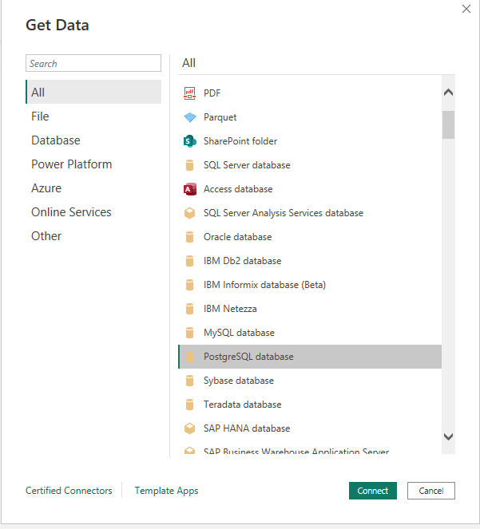
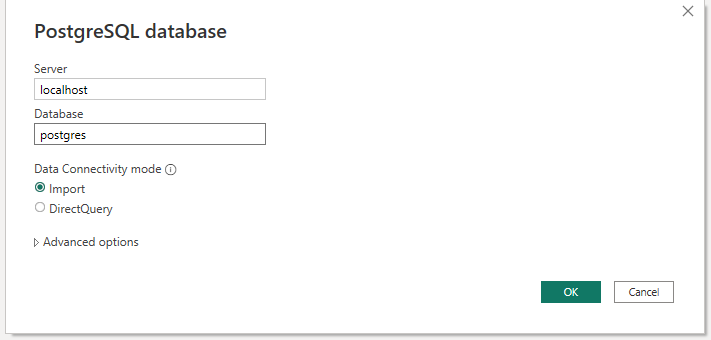

# ETL-PowerBI

## What's in this repository?

It contains the docker environment with the next features:

- PostgreSQL + PostGIS

- Jupyter 
  - Python 3.10
  - Packages:
    - notebook
    - matplotlib
    - seaborn
    - numpy
    - ipyvizzu
    - plotly
    - selenium
    - webdriver-manager
    - psycopg2-binary
    - SQLAlchemy 
    - powerbiclient


## Repository file structure
```
ih-data-powerbi
├─ .dockerignore
├─ .gitignore
├─ data
│  ├─ csv
│  │  ├─ ccaa_renta.csv
│  │  ├─ paro_ok.csv
│  │  ├─ provincias_renta.csv
│  │  ├─ votos_ccaa_ok.csv
│  │  ├─ votos_mesa_ok.csv
│  │  ├─ votos_municipios_ok.csv
│  │  └─ votos_province_ok.csv
│  ├─ df_mesas.csv
│  ├─ df_municipios.csv
│  ├─ df_provincias.csv
│  ├─ excel.ods
│  ├─ geojson
│  │  ├─ ccaa.csv
│  │  ├─ ccaa_geojson.sql
│  │  ├─ municipios_geojson.sql
│  │  └─ provincias_geojson.sql
│  ├─ gis_layers.qgz
│  └─ upload_geojson.sh
├─ docker-compose.yml
├─ jupyter
│  ├─ Dockerfile
│  ├─ extract.ipynb
│  ├─ extract_R.ipynb
│  ├─ load.ipynb
│  └─ transform.ipynb
├─ powerbi
│  ├─ 2019_Elections.pbix
└─ postgres
   ├─ Dockerfile
   ├─ db.sql


```

## Setup with docker-compose

>NOTE: to install this environment both [docker](https://docs.docker.com/get-docker/) and [docker-compose](https://docs.docker.com/compose/) are required

1. Clone the repository using git
```bash
git clone https://github.com/iaguerri/ih-data-powerbi.git
```

1. Move to the main repository's folder 

2. Build with docker-compose build

```bash
docker-compose build
```

4. Start the corresponding containers with docker-compose up

```bash
docker-compose up -d
```

5. Access the link to access Jupyter within the notebooks directory 

--------------------


## Database
To access the database through `pgadmin` use the `config_file.env` with the data found in the `docker-compose.yml` file
```
etl_server="localhost"
port="5432"
etl_dbname="postgres"
user="postgres"
pwd="postgres"
```
>NOTE: It should be located inside `data`

To access the database through `psql`:

1. Open a new terminal in the postgres container

```bash
docker exec -it ih-data-powerbi-postgres-1 /bin/bash
```

1. Initialize db with psql with user postgres

```bash
psql -U postgres
```

--------
## Connect PowerBI to Database

 

 

## Link to PPT
[PPT](https://docs.google.com/presentation/d/1wO_0wU0YHcT2CDyBrRidyojZVrA6dtGj1GfN8KIxO9s/edit?usp=sharing)
